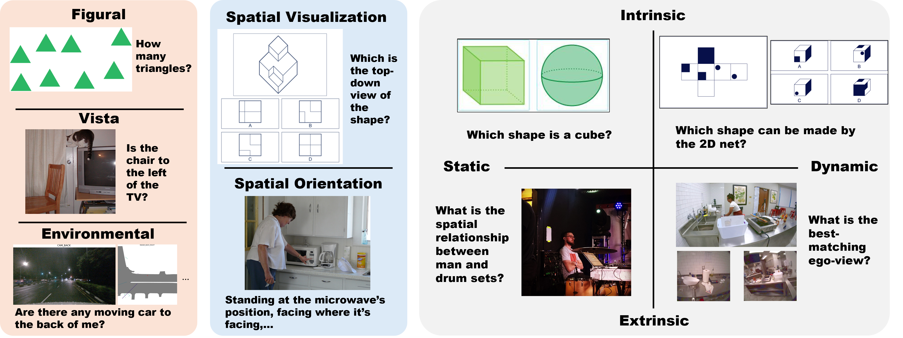

# SITE: towards Spatial Intelligence Thorough Evaluation
Wenqi Wang, Reuben Tan, Pengyue Zhu, Jianwei Yang, Zhengyuan Yang, Lijuan Wang, Andrey Kolobov, Jianfeng Gao, Boqing Gong

<font size=7><div align='left' > [[🍎 Project Page](https://wenqi-wang20.github.io/SITE-Bench.github.io/)] [[📖 arXiv Paper]()] [[📊 Dataset](https://huggingface.co/datasets/franky-veteran/SITE-Bench)]  </div></font>

<!-- add teaser figure -->


## SITE-Bench Overview

**Spatial intelligence (SI)** represents a cognitive ability encompassing the visualization, manipulation, and reasoning about spatial relationships, underpinning disciplines from neuroscience to robotics. We introduce **SITE**, a benchmark dataset towards **S**patial **I**ntelligence **T**horough **E**valuation in a standardized format of multi-choice visual question-answering, designed to assess large vision-language models's spatial intelligence across diverse visual modalities (single-image, multi-image, and video) and SI factors (figural to environmental scales, spatial visualization and orientation, intrinsic and extrinsic, static and dynamic). **Our approach to curating the benchmark combines a bottom-up survey about 31 existing datasets and a top-down strategy drawing upon three classification systems in cognitive science, which prompt us to design two novel types of tasks about view-taking and dynamic scenes.** Extensive experiments reveal that leading models fall behind human experts especially in spatial orientation, a fundamental SI factor. Moreover, we demonstrate a positive correlation between a model's spatial reasoning proficiency and its performance on an embodied AI task.

## Evaluation Pipeline

### Dataset 
We have released the dataset in the Hugging Face Hub. You can check the dataset [here](https://huggingface.co/datasets/franky-veteran/SITE-Bench). 

### Evaluation 
Thanks to [lmms-eval](https://github.com/EvolvingLMMs-Lab/lmms-eval) for providing a great evaluation framework. For reference, we provide the necessary files for evaluation under the lmms-eval framework.

Please refer to the [lmms-eval](https://github.com/EvolvingLMMs-Lab/lmms-eval) repository for installation and usage instructions. After installation, place the `eval_scripts/sitebench/` folder from our repository into the `lmms_eval/tasks/` directory within the lmms-eval framework.

Your `lmms-eval` directory structure should look like this:

```
lmms-eval/
├── README.md
├── docs/
├── tools/
├── lmms-eval/
│   ├── api/
│   ├── caching/
│   ├── models/
│   └── tasks/
│       ├── ...
│       ├── seedbench_2_plus/
│      *├── sitebench/      <= YOUR FOLDER
│       ├── stvqa/
│       ├── ...
...
```
After placing the `sitebench` folder, you can run the evaluation within `lmms-eval` directory using the following command:

```bash
# ######## llava_onevision_7b ########
TASK="site_bench_image"
MODEL_NAME="llava_onevision"
LOG_SUFFIX="${MODEL_NAME}_${TASK}"
PRETRAINED="lmms-lab/llava-onevision-qwen2-7b-ov"
python3 -m accelerate.commands.launch \
    --num_processes 4 \
    -m lmms_eval \
    --model $MODEL_NAME \
    --model_args pretrained=$PRETRAINED,device_map="auto",attn_implementation=flash_attention_2 \
    --tasks $TASK \
    --batch_size 1 \
    --log_samples \
    --log_samples_suffix $LOG_SUFFIX \
    --output_path "logs/"
```
For more models' evaluation, please refer to the `eval_scripts/run.sh`.

## VLA Experiments

### Getting Started

We build our finetuning and evaluation codebase off the opensourced [VLA codebase](https://openvla.github.io/). 


### Installation
We use the same installation instructions as those provided in the OpenVLA codebase and have included them below this statement for ease of reference. 

> **Note**: These installation instructions are for full-scale pretraining (and distributed fine-tuning); if looking to
  just run inference with OpenVLA models (or perform lightweight fine-tuning), see instructions above!

This repository was built using Python 3.10, but should be backwards compatible with any Python >= 3.8. We require
PyTorch 2.2.* -- installation instructions [can be found here](https://pytorch.org/get-started/locally/). The latest 
version of this repository was developed and thoroughly tested with:
  - PyTorch 2.2.0, torchvision 0.17.0, transformers 4.40.1, tokenizers 0.19.1, timm 0.9.10, and flash-attn 2.5.5

Once PyTorch has been properly installed, you can install this package locally via an editable installation (or via 
`pip install git+https://github.com/openvla/openvla`):

```bash
cd openvla
pip install -e .

# Training additionally requires Flash-Attention 2 (https://github.com/Dao-AILab/flash-attention)
pip install packaging ninja

# Verify Ninja --> should return exit code "0"
ninja --version; echo $?

# Install Flash Attention 2
#   =>> If you run into difficulty, try `pip cache remove flash_attn` first
pip install "flash-attn==2.5.5" --no-build-isolation
```

### Finetuning open-sourced VLMs

We finetune some open-sourced VLMs such as the LLaVa-OneVision and QwenVL-2.5 model variants using the Transformer library.

### Download LIBERO Dataset

To get started, please download the LIBERO dataset using the instructions on the official [project page](https://github.com/Lifelong-Robot-Learning/LIBERO).

### VLA Configuration & Training Script

The entry point for VLA training is [`vla-scripts/train.py`](vla-scripts/train.py). We use 
[`draccus`](https://pypi.org/project/draccus) to provide a modular, dataclass-based interface for specifying VLA 
training configurations; existing VLA configurations are in [`prismatic/conf/vla.py`](prismatic/conf/vla.py). You can 
add your own training configuration and refer to it using the `--vla.type` command line argument.

We wrap our model training using the accelerate framework for distributed training across multiple GPUs. You can launch the training for the LlaVa-OneVision and QwenVL-2.5 base models using the following commands:

```bash
# Train base VLMs on LIBERO fewshot data
accelerate launch --config_file accelerate_8g_ds1_config.yaml vla-scripts/finetune_llavaov.py --vla_path llava-hf/llava-onevision-qwen2-{0.5b/7b}-ov-hf --data_root_dir <PATH TO LIBERO DATA ROOT> --dataset_name 'libero_spatial_no_noops' --batch_size 1 --save_steps 3000 --max_steps 60000 --learning_rate 2e-5 --ddp false --image_aug True --constant_lr True --max_grad_norm 3.0 --save_by_epoch_and_max_epoch 30 --note FS-40 --run_root_dir <PATH TO RUN DIR>

accelerate launch --config_file accelerate_8g_ds1_config.yaml vla-scripts/finetune_qwenvl.py --vla_path Qwen/Qwen2.5-VL-7B-Instruct --data_root_dir <PATH TO LIBERO DATA ROOT> --dataset_name 'libero_spatial_no_noops' --batch_size 1 --save_steps 3000 --max_steps 60000 --learning_rate 2e-5 --ddp false --image_aug True --constant_lr True --max_grad_norm 3.0 --save_by_epoch_and_max_epoch 30 --note FS-160 --run_root_dir <PATH TO RUN DIR>
```

### VLA Evaluation

We also provide evaluation scripts to evaluate the finetuned VLMs on the LIBERO benchmark. After the models are trained, you can evaluate them using the following commands:

```bash
# Evaluate finetuned VLMs on LIBERO
python experiments/robot/libero/run_libero_eval_llavaov.py --model_family llavaov --pretrained_checkpoint <PATH TO FINETUNED CHECKPOINT>  --task_suite_name libero_spatial --center_crop True --num_trials_per_task 10

python experiments/robot/libero/run_libero_eval_qwenvl.py --model_family qwenvl --pretrained_checkpoint <PATH TO FINETUNED CHECKPOINT>  --task_suite_name libero_spatial --center_crop True --num_trials_per_task 10
```

## Contact

Please do not hesitate to contact us if you have any questions or face any issues.